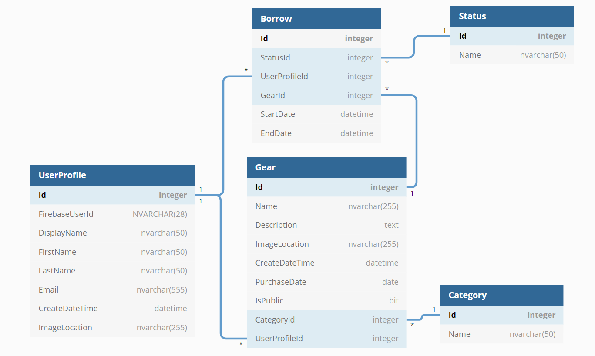
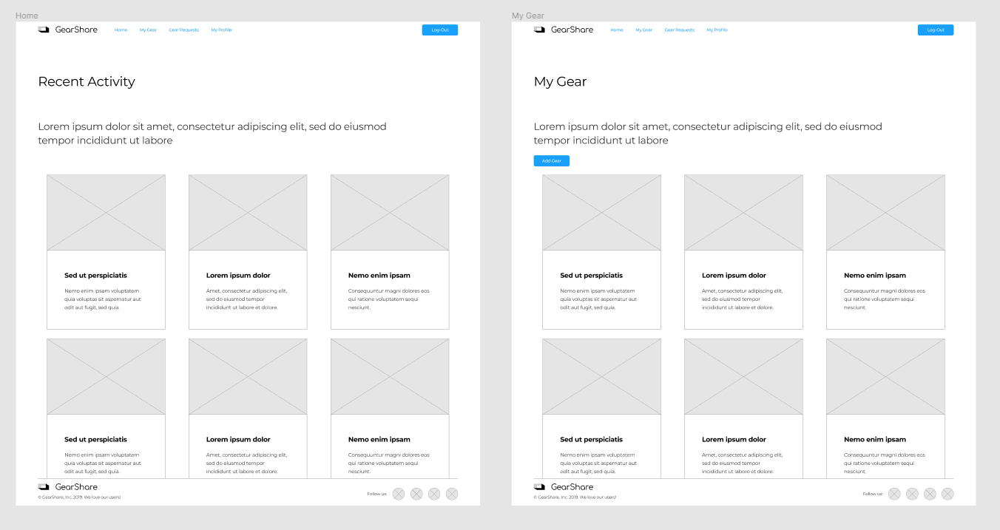
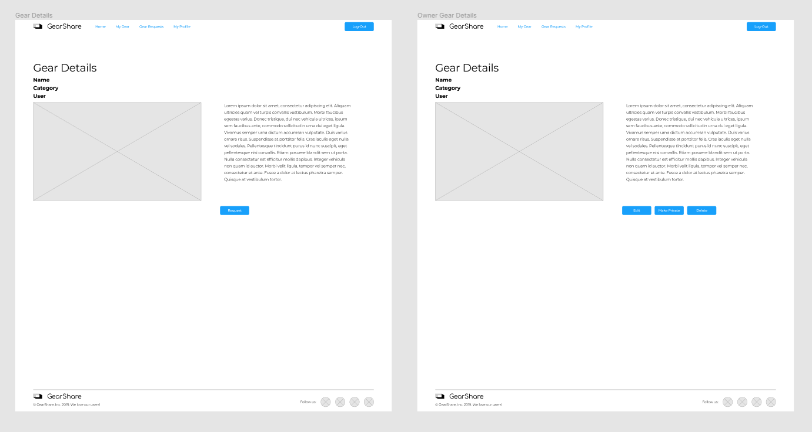
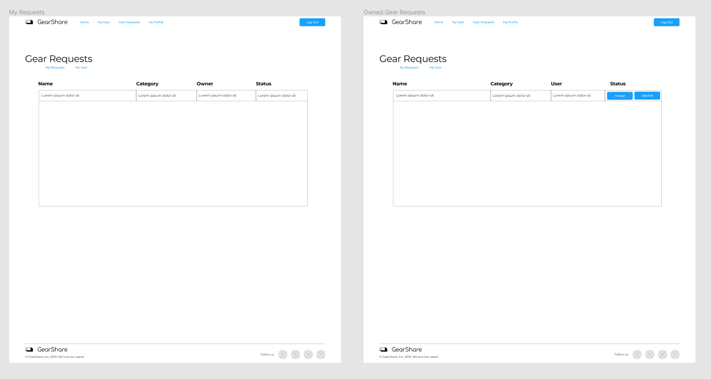
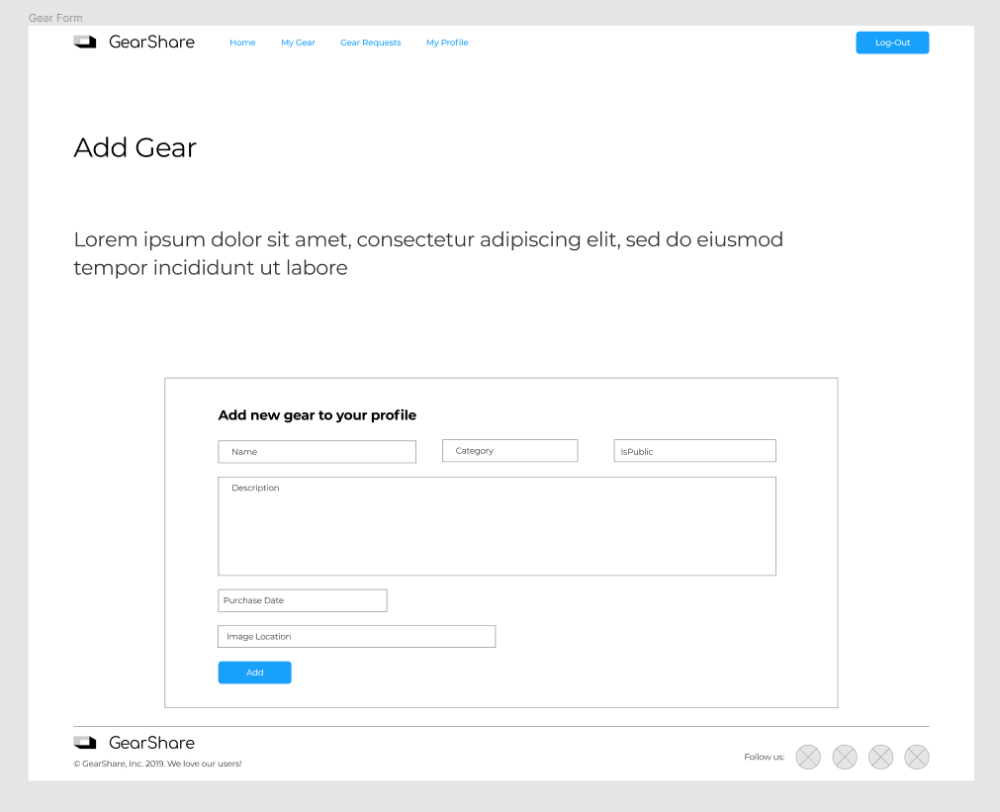
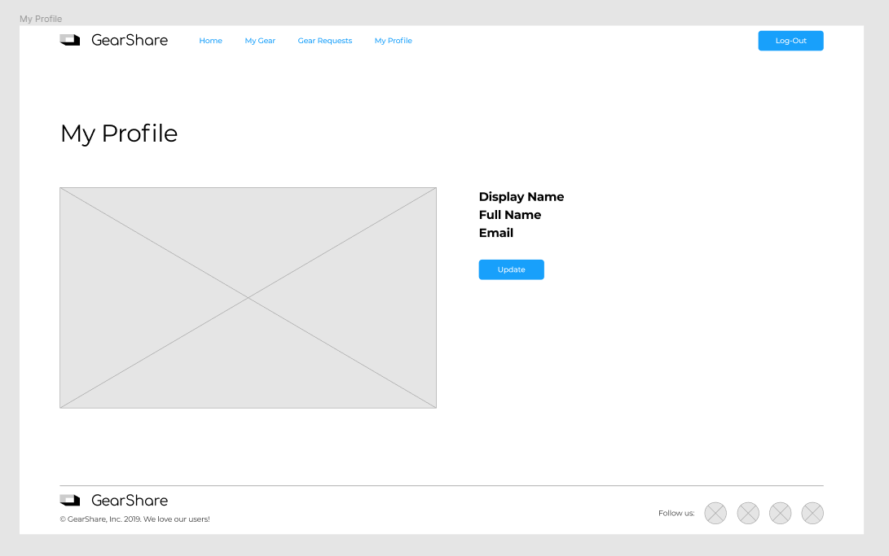
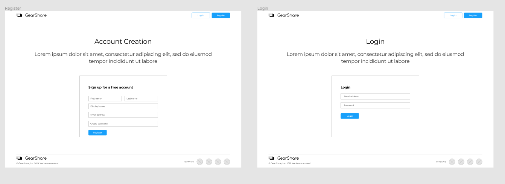

# GearShare

**_GearShare_** is an app developed for musicians and artists. Our goal is to help facilitate users sharing gear between each other to use for shows, studio work, etc.

## Setup

### Clone the project

From a terminal window, in any directory you'd like, run: `git clone git@github.com:cslunetta/GearShare.git`

### Firebase

Create a Firebase project to have working authentication and authorization.

-   Go to [Firebase](https://firebase.google.com/) and create a project (can be named anything). Add authentication in the form of email/password to the project.
-   In the project settings, you will need your `Project Id` and `Web API Key`

### Back-end setup

-   Create a file In `GearShare/` directory along side the appsettings.json file called `appsettings.Local.json` and add the following changing the `FirebaseProjectId` value to your Firebase `Project Id` 
``` 
{
  "FirebaseProjectId": "********"
}
```
-   From `GearShare/SQL`, run the scripts `01_Db_Create.sql` and then `02_Seed_Data` to generate the database
-   To access an account from the database create a user account in your Firebase project's auth section with the email address and set a password. Then replace the data in that user's `FirebaseUserId` column in the database with the id generated in your Firebase project
-   Load `GearShare.sln` in Visual Studio and hit F5 to run the GearShare server 

### Front-end Setup

-   Create a file in `GearShare/client/` called `.env.local`
-   In this file, paste `REACT_APP_API_KEY=Web API Key`, replacing "Web API Key" with your unique key from your Firebase project's project settings
-   Run `npm install --save bootstrap reactstrap` in `GearShare/client` to install all dependencies
-   To start the development server on `localhost:3000`, run `npm start`
-   A browser window should open with the authentication page and you can enter the email and password you added in Firebase

---

### Built with

-   [React](https://reactjs.org/)
-   [.NET 5](https://dotnet.microsoft.com/)

## Technology used

### Front-end

-   ReactJS
-   Firebase authentication
-   Reactstrap
-   Bootstrap
-   CSS

### Back-end

-   .NET 5
-   ASP.NET Core
-   Microsoft SQL Server

### Design and Development

-   Figma
-   DbDiagram.io

---

### Entity Relationship Diagram (ERD) & Mockups

</img>
---

</img>
</img>
</img>
</img>
</img>
</img>
